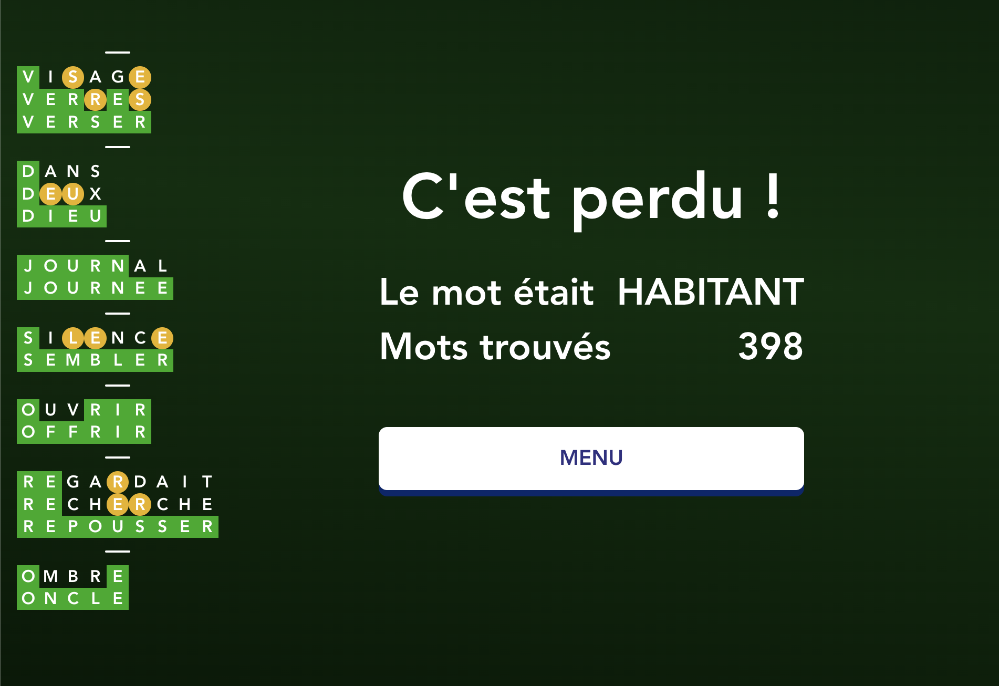

# C'est quoi ?

C'est une extension chrome pour automatiser les réponses sur le site [https://www.tusmo.xyz](https://www.tusmo.xyz)

# Pourquoi ?

Parce qu'on rageait de pas trouver les mots pourtant si simples

# Comment ?

-   Aller dans [chrome://extensions](chrome://extensions)
-   Cocher le mode développeur en haut à droite
-   Charger une extension non empaquetée
-   Choisissez le dossier de ce repo
-   Allez sur [https://www.tusmo.xyz](https://www.tusmo.xyz), jouez en solo, multi, tuzmo, bref, laissez le bot jouer.

# Record

Notre record (sans effort)

# Ca bug !

Oui, il y a des bugs. Ce projet est le fruit de 3 ou 4 heures de travail. Faut pas s'attendre à quelque chose de ouffissime.
